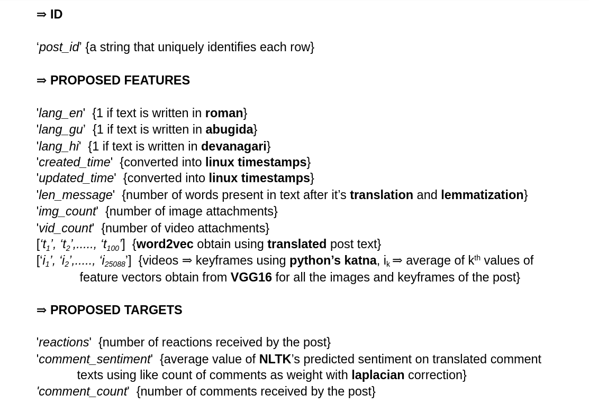

# fb_project
# implemented in python3
# explanation of extracted features

# neural net for predicting reaction count

# Structure
The project has three parts data_scraping, feature_extraction and ml_model
## Important
The files are seperated in three different folders but for running the code the files need to be in the directory that contains the utils directory.